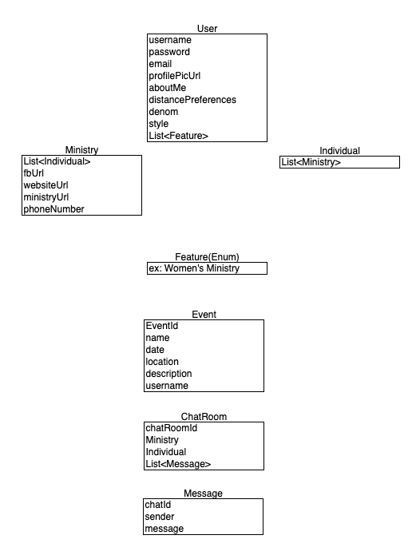

# Gather Backend

This is the Backend of the Gather Project. The goal of this project is to connect Individuals with Ministries in their area. Our technology stack is: 
- Java 
- SpringBoot
- Firebase(NoSql)
- WebSocket

Below is a visual representation of the different models and their fields. 

## Firebase

[Firebase](https://firebase.google.com) is the database that the Gather Backend uses.

To set it up, *go to console* and click on the __Create a project__ button. Enter a project name. Click the __Continue__ button. Accept both terms and click on the __Create project__ button. After the project is created, click on the __Continue__ button to go to the new project.

On the left, under *Develop*, click on *Cloud Firestore*, and then the __Create database__ button. Select *Start in __test mode__* and then click on the __Next__ button. Click on the __Enable__ button. After it has provisioned the Firestore, click on the ⚙ (gear) icon to the right of *Project Overview*. Choose the *Service accounts* tab and select *Java*. Scroll down and click on the __Generate new private key__ button.

In your Downloads folder, move the JSON file (the private key) to a safe location outside of the project folder. Set the environmental variable GATHER\_SERVICE\_ACCOUNT\_KEY to the location of this file. Assign the text on `.setDatabaseUrl("url")` to the environmental variable GATHER\_DATABASE\_URL. Instructions on setting environmental variables are available for [Windows 10](https://www.minitool.com/news/environment-variables-windows-10-005.html) and [bash/zsh](https://flaviocopes.com/shell-environment-variables/).

Finally, test your setup by running the command `mvn clean install` in the project directory. You need to have [Maven](https://maven.apache.org) installed in order to do this.

